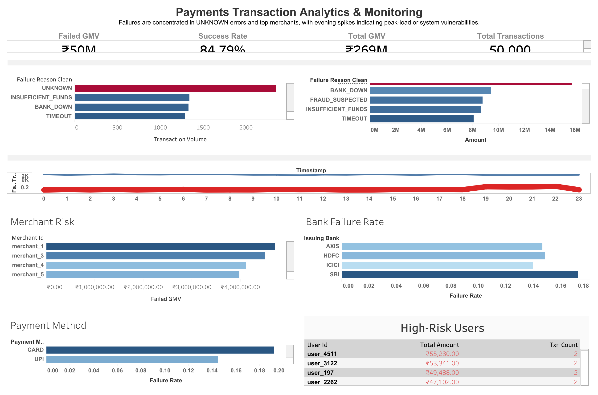

# Fintech Transaction Monitoring System

Simulates real-world transaction monitoring used by fintech companies like Slice, Razorpay, and Paytm.

End-to-end analytics system that simulates how fintech companies monitor transactions, diagnose failures, and detect high-risk users.

---

## Live Dashboard

Explore the interactive dashboard here:  
https://public.tableau.com/views/PaymentsTransactionsAnalyticsMonitoring/Dashboard1?:language=en-US&publish=yes&:sid=&:redirect=auth&:display_count=n&:origin=viz_share_link

No setup required - explore filters, drill-downs, and risk patterns directly.

---

## Problem

Payment systems process thousands of transactions per minute. Even small failure rates can lead to:

- Revenue leakage (failed GMV)
- Poor user experience
- Operational blind spots
- Increased fraud risk

This project replicates a **real-world monitoring setup** used by fintech teams to identify issues and take action.

---

## What this project demonstrates

- Business-first data analysis  
- KPI design & monitoring  
- SQL-driven insights  
- Dashboard storytelling  
- Risk & fraud detection logic  

Not just a dashboard - this is a **decision-support system**

---

## System Architecture

```
Raw Data → Python Processing → SQL Analysis → Tableau Dashboard
```

### 1. Data Layer
- Synthetic dataset (~50,000 transactions)
- Fields: users, merchants, banks, payment methods, timestamps, status

### 2. Processing Layer (Python)
- Data cleaning & validation  
- Feature engineering (failure flags, risk indicators)

### 3. Analysis Layer (SQL)
- KPI computation  
- Failure trend analysis  
- Risk segmentation  
- Business-driven queries  

### 4. Visualization Layer (Tableau)
- Interactive monitoring dashboard  
- Diagnostic + exploratory views  

---

## Key KPIs

- **Total GMV**
- **Failed GMV**
- **Success Rate**
- **Total Transactions**

---

## Key Insights

- Failures are heavily driven by **UNKNOWN errors** (system-level issue)
- Failure rates spike **post 7 PM**, indicating peak-load stress
- A small set of merchants drives a large share of failed GMV (Pareto effect)
- Certain banks show consistently higher failure rates
- High-risk users exhibit repeated high-value transactions

---

## Business Impact

If deployed in production, this system would:

- Reduce failed GMV by identifying top failure drivers  
- Improve system reliability via peak-load monitoring  
- Enable proactive fraud detection using risk signals  
- Support product and ops teams with actionable insights  

---

## Key Questions Answered

- What are the main drivers of failed transactions?
- When do failures spike and why?
- Which merchants contribute most to revenue loss?
- Which banks/payment methods are least reliable?
- Which users show high-risk behavior and should be investigated?

---

## Tech Stack

- **Python** - data generation & preprocessing  
- **SQL** - analytical queries  
- **Tableau** - visualization & monitoring  

---

## Project Structure

```
fintech-transaction-analytics-monitoring-system/
│
├── data/
│   ├── raw/
│   └── processed/
│
├── src/
│   ├── generate_dataset.py
│   ├── dataset_validation.py
│   └── python_export.py
│
├── sql/
│   ├── 01_eda_queries.sql
│   ├── 02_kpi_queries.sql
│   ├── 03_risk_analysis.sql
│   ├── 04_advanced_analysis.sql
│   └── 05_business_questions.sql
│
├── dashboard/
│   ├── tableau_dashboard.twbx
│   └── screenshots/
│       └── fintech_dashboard_preview.png
│
├── docs/
│   └── data_dictionary.md
│
├── requirements.txt
└── README.md
```

---

## Dashboard Preview



Interactive version: https://public.tableau.com/views/PaymentsTransactionsAnalyticsMonitoring/Dashboard1?:language=en-US&publish=yes&:sid=&:redirect=auth&:display_count=n&:origin=viz_share_link

---

## How to Run

### 1. Clone the repository
```bash
git clone https://github.com/your-username/fintech-transaction-analytics-monitoring-system.git
cd fintech-transaction-analytics-monitoring-system
```

### 2. Install dependencies
```bash
pip install -r requirements.txt
```

### 3. Generate dataset
```bash
python src/generate_dataset.py
```

### 4. Validate dataset
```bash
python src/dataset_validation.py
```

### 5. Open dashboard
- Open `.twbx` file in Tableau  
- Explore metrics and insights  

---

## Risk Detection Logic

Rule-based detection using:

- High transaction frequency  
- High-value transactions  
- Repeated failures  
- Combined risk signals  

---

## Decisions & Trade-offs

- **Rule-based fraud detection over ML**: Chosen for interpretability, faster iteration, and lower data requirements. In early-stage systems, explainability is critical for ops teams.
- **KPI-first monitoring**: Prioritized GMV, Success Rate, and Failed GMV to directly track business impact (revenue and reliability) instead of starting with complex models.
- **Failure analysis before optimization**: Focused on identifying failure drivers (UNKNOWN errors, bank issues, peak hours) to enable targeted fixes with highest ROI.
- **Batch analytics vs real-time**: Implemented batch analysis for simplicity; real-time streaming (Kafka) is a natural next step for production.
- **Top-N views for clarity**: Used Top merchants/users to highlight Pareto effects and keep dashboards actionable, avoiding information overload.

---

## Future Improvements

- Real-time streaming pipeline  
- ML-based fraud detection  
- Automated alerting system  
- Drill-down investigation views  

---

## Author

Shubham Singh
