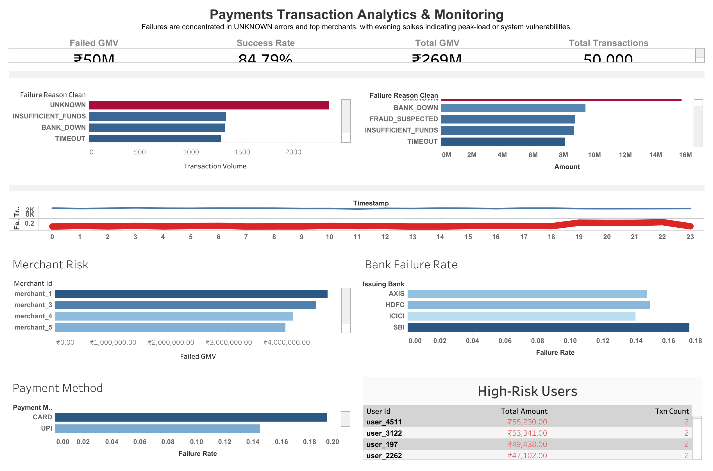

# Fintech Transaction Monitoring System

## Problem This Solves

Fintech teams lose revenue and user trust when payment failures are visible only after someone manually investigates logs. The core problem is turning transaction data into a failure, risk, and merchant-health command center.

## How It Helps

- Generates a realistic payments dataset and validates failure rates, unexplained failures, merchant concentration, peak-hour issues, bank variance, and fraud flags.
- Gives founders and fintech operators a starter analytics layer for failed GMV, success rate, risk signals, and operational root-cause questions.
- Pairs Python generation and validation with SQL modules and Tableau-ready dashboarding.

## When To Fork This

- Fork this if you are building payment ops, fintech risk analytics, merchant monitoring, or transaction reliability reporting.
- Fork it when your team needs to know which failures are product reliability issues, bank/provider issues, merchant issues, or suspicious user behavior.
- Swap the synthetic generator for your PSP, bank, or transaction exports, then adapt the SQL and dashboard views.

**End-to-end payments analytics pipeline** monitoring 50,000+ transactions 
across GMV tracking, failure diagnosis, risk scoring, and merchant analytics.

Built to replicate how fintech companies like Slice, Razorpay, and Paytm 
monitor payment health and diagnose revenue leakage in real time.

---

## Use This In Your Company

This repo is designed to be forked into an internal company workflow. Fork it, replace the sample inputs with your company context, and keep only the parts that match your operating cadence. No permission request or sales call is needed before using it; the repo is the handoff. Check the license if you plan to redistribute your version.

- Use it as a transaction analytics starter for fintech, payments, wallet, or banking operations teams.
- Keep the pipeline: sample transactions, monitoring logic, anomaly outputs, and dashboard-ready tables.
- Replace sample transaction data with your own sanitized processor, bank, or internal export.

## Minimum Edits To Make It Yours

- transaction schema mapping
- failure/anomaly thresholds
- customer or merchant segments
- dashboard labels

The fastest path is: fork the repo, replace the inputs above, run the demo or open the template, then adjust only the parts that reflect your company's workflow.

## Key Metrics

| Metric | Value |
|---|---|
| Transactions Analyzed | 50,000+ |
| KPIs Tracked | GMV, Failed GMV, Success Rate, Transaction Volume |
| Risk Signals | High-frequency users, repeated failures, high-value anomalies |
| SQL Query Modules | 5 (EDA → KPI → Risk → Advanced → Business Questions) |

---

## The Problem

Payment systems process thousands of transactions per minute. Even small 
failure rates cause revenue leakage, poor UX, and operational blind spots.

**Key questions this system answers:**
- What are the main drivers of failed transactions?
- When do failures spike — and why?
- Which merchants contribute most to revenue loss?
- Which banks and payment methods are least reliable?
- Which users show high-risk behavior and need investigation?

---

## Key Findings

- **UNKNOWN errors** are the primary failure driver — a system-level issue, not user behavior
- **Failures spike post 7 PM** — peak-load stress, not fraud
- **Top merchants (Pareto effect)** — a small set drives a disproportionate share of failed GMV
- **Bank-level variance** — certain banks show consistently higher failure rates
- **High-risk users** exhibit repeated high-value transactions with failure patterns

---

## Design Decisions

**Rule-based risk detection over ML** — chosen for interpretability and faster 
iteration. In early-stage fintech systems, ops teams need to explain flags to 
compliance. Black-box models create friction.

**KPI-first monitoring** — GMV, Success Rate, and Failed GMV directly track 
business impact before diving into complex models.

**Batch analytics over real-time** — implemented for simplicity and portability. 
Real-time streaming (Kafka) is the natural next step for production deployment.

**Top-N views for clarity** — Pareto-style merchant and user ranking keeps 
dashboards actionable and avoids information overload.

---

## Dashboard Preview



**[Open Live Tableau Dashboard](https://public.tableau.com/views/PaymentsTransactionsAnalyticsMonitoring/Dashboard1)**  
No setup required — explore filters, drill-downs, and risk patterns directly.

---

## Tech Stack

`Python` · `SQL` · `Pandas` · `Tableau Public`

**Pipeline:**

Raw Data → Python Processing → SQL Analysis → Tableau Dashboard

---

## How to Run

```bash
# 1. Clone the repo and install dependencies
pip install -r requirements.txt

# 2. Generate synthetic dataset
python3 src/generate_dataset.py

# 3. Validate dataset
python3 src/dataset_validation.py

# 4. Run SQL queries in your client against the processed data
# 5. Open dashboard/tableau_dashboard.twbx in Tableau
```

Optional MySQL export uses environment variables from `.env.example`:
`MYSQL_HOST`, `MYSQL_PORT`, `MYSQL_USER`, `MYSQL_PASSWORD`, and
`MYSQL_DATABASE`. Do not hardcode database credentials in source files.

---

## Real-World Application

Mirrors monitoring infrastructure used by fintech ops and product teams to:
- Reduce failed GMV by identifying top failure drivers early
- Improve system reliability via peak-load monitoring
- Enable proactive fraud detection using behavioral signals
- Give product and ops teams actionable, self-serve dashboards

---

*Part of a founder/operator toolkit for people building practical startup operating systems.*  
*[← Back to Profile](https://github.com/shubham1502-hue)*
